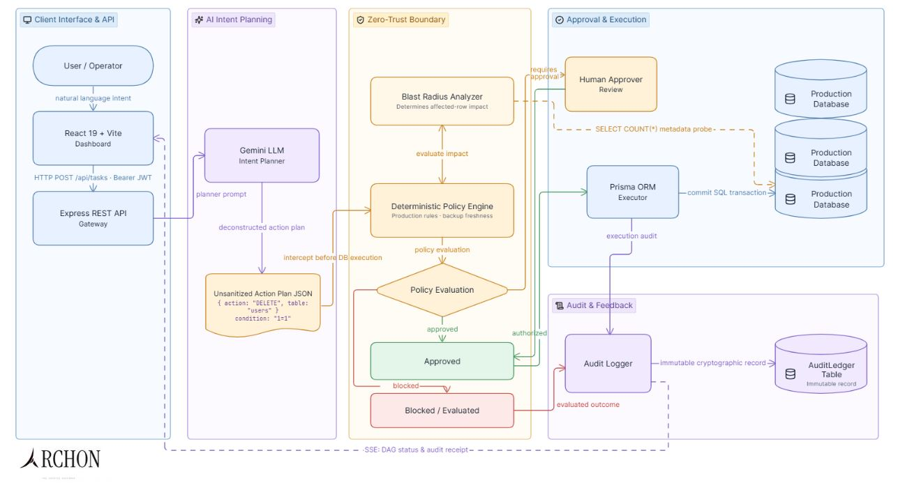
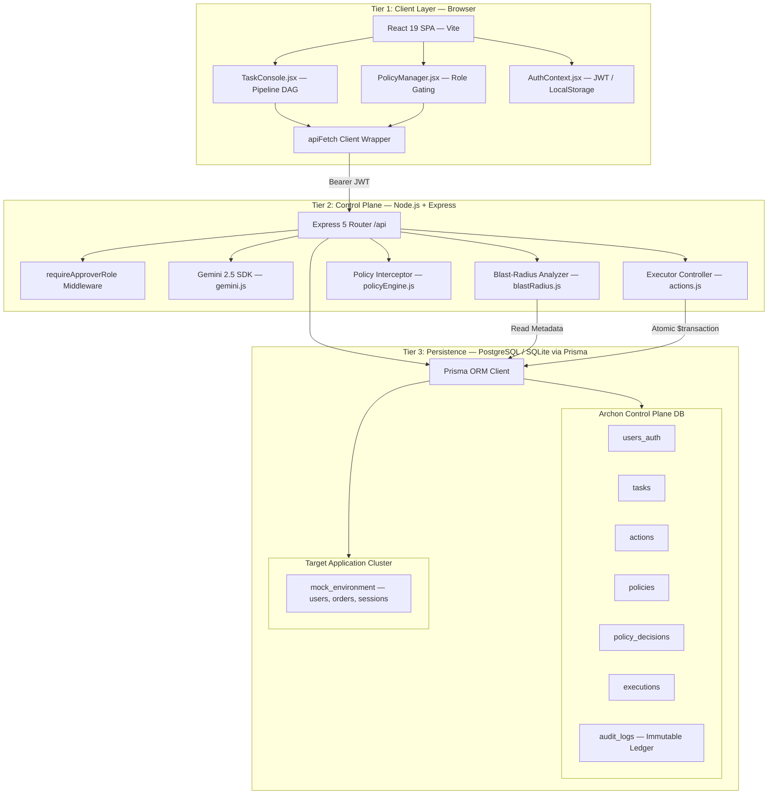
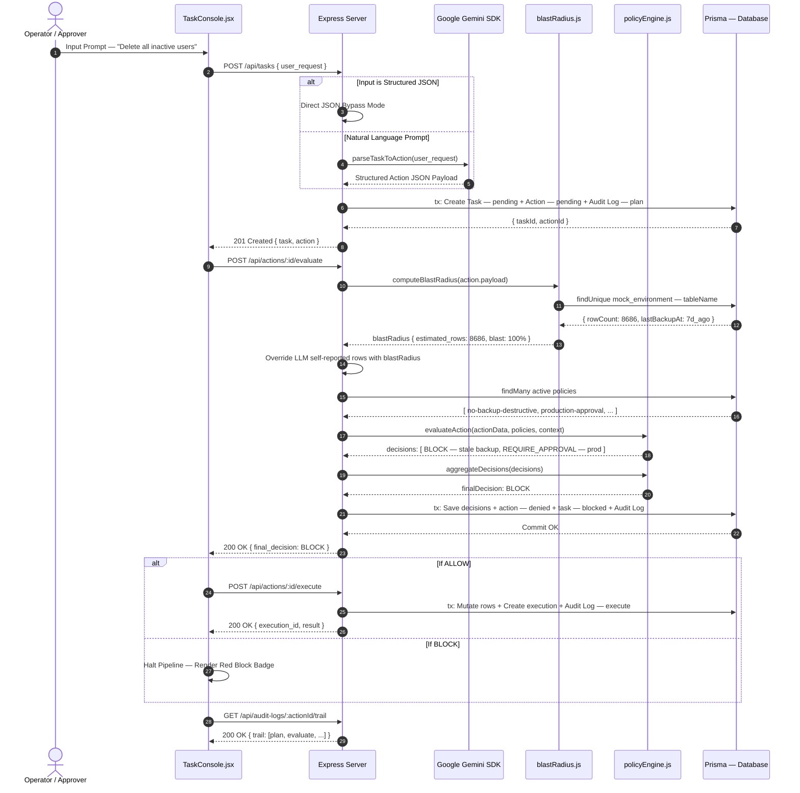

<p align="center">
  
</p>

<h1 align="center">ARCHON</h1>
<h3 align="center">Zero-Trust Database Governance Firewall for Autonomous AI Agents</h3>

<p align="center">
  <a href="https://archon-lyart.vercel.app"></a>
  <a href="#tech-stack"></a>
  <a href="#tech-stack"></a>
  <a href="#tech-stack"></a>
  <a href="#tech-stack"></a>
</p>

<p align="center">
  <em>When LLMs talk to databases, who's watching?</em>
</p>

---

##  The Problem

Large Language Models are increasingly being deployed as autonomous agents that interact with production databases — deleting records, modifying schemas, and executing bulk operations based on natural language commands.

**The critical issue:** LLMs hallucinate. They misestimate row counts, misjudge risk levels, and cannot reliably self-report the blast radius of their own operations. An LLM asked to *"clean up inactive users"* might confidently report it will affect 200 rows, when the actual impact is 8,686 rows — the entire table.

**Existing solutions** like database permissions and RBAC only answer *"can this agent run DELETE?"* They don't answer *"should this specific DELETE affecting 100% of the users table in production be allowed without human review?"*

##  The Solution

**Archon** is a deterministic governance firewall that sits between AI agents and production databases. It intercepts every LLM-generated operation, independently verifies the real-world impact using live database metadata, and enforces configurable policy rules before any byte is mutated.

### Core Principle: **Zero Trust for AI Agents**

> The LLM is treated as an untrusted actor. Its self-reported risk scores, row estimates, and safety assessments are **completely discarded** and replaced with deterministic calculations from actual database state.

---

##  Core Architecture

<p align="center">
  
</p>

The system is organized into **5 architectural layers**, each with strict isolation boundaries:

| Layer | Purpose | Key Components |
|:------|:--------|:---------------|
| **Client Interface & API** | Operator command ingestion & live pipeline visualization | React 19 + Vite Dashboard, JWT Auth |
| **AI Intent Planning** | Parse natural language into structured action plans | Gemini 3.6 Flash LLM, Schema-enforced JSON output |
| **Zero-Trust Boundary** | Intercept, verify, and gate all operations | Deterministic Policy Engine, Blast Radius Analyzer |
| **Approval & Execution** | Human-in-the-loop review + atomic DB transactions | Approver role gating, Prisma ORM Executor |
| **Audit & Feedback** | Immutable compliance trail + real-time client updates | Cryptographic Audit Logger, SSE feedback loop |

### How It Works — The 4-Stage Pipeline

```
  ┌──────────────────┐     ┌──────────────────┐     ┌──────────────────────────┐     ┌─────────────────┐
  │  1. DECONSTRUCT  │ ──► │  2. BLAST RADIUS │ ──► │  3. POLICY INTERCEPTION  │ ──► │  4. EXECUTE or  │
  │                  │     │                  │     │                          │     │     BLOCK       │
  │  NL Prompt ──►   │     │  SELECT COUNT(*) │     │  5 Deterministic Rules   │     │                │
  │  Gemini parses   │     │  from live DB    │     │  BLOCK > APPROVAL > ALLOW│     │  Atomic Prisma  │
  │  into JSON plan  │     │  Override LLM    │     │  Human-in-the-loop gate  │     │  $transaction   │
  └──────────────────┘     └──────────────────┘     └──────────────────────────┘     └─────────────────┘
```

**Key innovation:** Between stages 1 and 3, **the LLM's self-reported row estimates are completely overwritten** with real counts from a deterministic database metadata probe (`SELECT COUNT(*)`). This ensures policy decisions are based on ground truth, not hallucinations.

---

##  Deep Dive: What Makes Archon Different

### 1. Blast Radius Analyzer — Ground Truth Over Hallucination

When Gemini reports *"this DELETE will affect ~200 rows"*, Archon doesn't trust it:

```javascript
// backend/src/lib/blastRadius.js
// LLM says 200 rows. We query the actual database:
const tableData = await prisma.mockEnvironment.findUnique({
  where: { tableName: action.target_table }
});
// Real answer: 8,686 rows. Blast radius: 100%.
```

The analyzer detects tautology conditions (`WHERE 1=1`, `WHERE ALL`, `WHERE true`) and automatically assigns 100% blast radius — something an LLM might miss or underestimate.

### 2. Deterministic Policy Engine — Code Over Probability

Five configurable policy rules run as pure, stateless functions:

| Policy Rule | Trigger | Verdict |
|:------------|:--------|:--------|
| `no-unbounded-destructive` | DELETE/DROP with no WHERE clause or tautology condition | **BLOCK** |
| `max-rows-threshold` | Operations exceeding 5,000 estimated rows | **BLOCK** |
| `production-destructive-approval` | Any DELETE/DROP in production environment | **REQUIRE_APPROVAL** |
| `no-backup-destructive` | Destructive op when last backup > 24 hours old | **BLOCK** |
| `scope-violation` | Queries targeting unmanaged/unauthorized tables | **BLOCK** |

**Decision aggregation is deterministic:** `BLOCK` always overrides `REQUIRE_APPROVAL`, which always overrides `ALLOW`. There is no probabilistic reasoning — it's pure boolean logic.

### 3. Immutable Cryptographic Audit Ledger

Every operation — whether approved, blocked, or pending — generates an immutable audit trail entry with:
- SHA-256 hash chain linking each entry to its predecessor
- Actor identification (which component: `planner_agent`, `policy_engine`, `executor`)
- Full payload snapshots for forensic reconstruction
- Microsecond-precision timestamps

---

##  Tech Stack

<a name="tech-stack"></a>

| Layer | Technology | Version | Purpose |
|:------|:-----------|:--------|:--------|
| **Frontend** | React | 19.x | SPA with pipeline DAG visualization |
| | Vite | 8.x | Build tooling & HMR dev server |
| | React Router | v7 | Client-side routing |
| | Tailwind CSS | v4 | Utility-first styling |
| **Backend** | Node.js | 20+ | Runtime |
| | Express | 5.2 | HTTP framework with async middleware |
| | Prisma | 5.22 | Type-safe ORM with migrations |
| | Bcrypt | 5.1 | Password hashing |
| | JSON Web Token | 9.0 | Stateless session auth |
| **AI** | Google Generative AI SDK | latest | Gemini 3.6 Flash intent parsing |
| **Database** | SQLite | — | Development (local file) |
| | PostgreSQL | 15+ | Production (Render managed) |

---

## 📡 API Reference

All routes are mounted under `/api`. Authentication uses Bearer JWT tokens where noted.

### Auth & Identity

| Method | Endpoint | Auth | Description |
|:-------|:---------|:-----|:------------|
| `POST` | `/api/auth/login` | Public | Authenticate with email/password. Returns JWT (24h TTL) + role. |
| `GET` | `/api/auth/me` | Bearer JWT | Verify active session. Returns `{ userId, email, role }`. |

### Task Pipeline

| Method | Endpoint | Auth | Description |
|:-------|:---------|:-----|:------------|
| `POST` | `/api/tasks` | Public | Ingest natural language or JSON prompt. Creates Task + Action + Audit Log in one transaction. |
| `GET` | `/api/tasks` | Public | List recent tasks with joined action, policy decision, and execution status. |

### Action Evaluation & Execution

| Method | Endpoint | Auth | Description |
|:-------|:---------|:-----|:------------|
| `POST` | `/api/actions/:id/evaluate` | Public | Compute blast radius from live DB, run policy rules, return verdict (ALLOW/BLOCK/REQUIRE_APPROVAL). |
| `POST` | `/api/actions/:id/execute` | Public | Execute approved action atomically. Rejects with `409` if action is not approved. |

### Policy Management

| Method | Endpoint | Auth | Description |
|:-------|:---------|:-----|:------------|
| `GET` | `/api/policies` | Public | List all policy rules (active + inactive). |
| `PUT` | `/api/policies/:id` | **Approver JWT** | Toggle policy active state, update rules or description. Role-gated. |

### Environment & Monitoring

| Method | Endpoint | Auth | Description |
|:-------|:---------|:-----|:------------|
| `GET` | `/api/environment` | Public | Live row counts, backup ages, and schemas for all managed tables. |
| `POST` | `/api/environment/reset` | Public | Reset mock environment to baseline demo state. |
| `GET` | `/api/health` | Public | Health check: runs `SELECT 1` to verify DB connectivity. |

### Audit Trail

| Method | Endpoint | Auth | Description |
|:-------|:---------|:-----|:------------|
| `GET` | `/api/audit-logs` | Public | Global audit ledger. Supports `?entity_type`, `?actor`, `?limit` filters. |
| `GET` | `/api/audit-logs/:entityId/trail` | Public | Chronological audit timeline for a specific action (plan → evaluate → execute). |

---

## Database Schema

Archon maintains two isolated database regions:

### Control Plane Tables (Internal — AI agents cannot target these)

```prisma
model UserAuth {
  id        String   @id @default(uuid())
  email     String   @unique
  password  String                    // bcrypt hashed
  role      String   @default("operator")  // "operator" | "approver"
}

model Task {
  id          String   @id @default(uuid())
  prompt      String                  // Original user request
  status      String   @default("pending")  // pending → completed | blocked
  priority    String   @default("medium")
  environment String   @default("production")
  actions     Action[]
}

model Action {
  id         String   @id @default(uuid())
  taskId     String
  payload    String                   // JSON: { action_type, target_table, condition, ... }
  status     String   @default("pending")  // pending → approved | denied → executed
  task       Task     @relation(fields: [taskId])
}

model Policy {
  id          String   @id @default(uuid())
  name        String   @unique
  description String
  rules       String                  // JSON rule configuration
  isActive    Boolean  @default(true)
}

model AuditLog {
  id         String   @id @default(uuid())
  entityType String                   // "task" | "action"
  entityId   String
  actor      String                   // "planner_agent" | "policy_engine" | "executor"
  step       String                   // "plan" | "evaluate" | "execute"
  details    String                   // Full JSON payload snapshot
  createdAt  DateTime @default(now())
}
```

### Target Application Tables (Managed — AI agents operate here)

```prisma
model MockEnvironment {
  id           String    @id @default(uuid())
  tableName    String    @unique       // "users" | "orders" | "sessions"
  rowCount     Int       @default(0)
  schema       String                  // JSON column definitions
  lastBackupAt DateTime?
}
```

---

##  Quick Start

### Prerequisites

- Node.js 20+
- npm or yarn
- A Google Gemini API key ([Get one here](https://makersuite.google.com/app/apikey))

### 1. Clone & Install

```bash
git clone https://github.com/your-username/archon.git
cd archon

# Install backend dependencies
cd backend
npm install

# Install frontend dependencies
cd ../frontend
npm install
```

### 2. Configure Environment

Create `backend/.env`:

```env
PORT=4000
DATABASE_URL="file:./dev.db"
JWT_SECRET="your-secure-random-secret-key"
GEMINI_API_KEY="your-google-gemini-api-key"
```

Create `frontend/.env`:

```env
VITE_API_URL="http://localhost:4000"
```

### 3. Initialize Database

```bash
cd backend

# Generate Prisma client & run migrations
npx prisma generate
npx prisma db push

# Seed demo data (users, policies, mock environment)
node prisma/seed.js
```

### 4. Run Development Servers

```bash
# Terminal 1 — Backend (port 4000)
cd backend
npm run dev

# Terminal 2 — Frontend (port 5173)
cd frontend
npm run dev
```

Open [http://localhost:5173](http://localhost:5173) in your browser.

### 5. Demo Credentials

| Role | Email | Password |
|:-----|:------|:---------|
| Operator | `operator@archon.dev` | `operator123` |
| Approver | `admin@archon.dev` | `admin123` |

---

##  Usage Examples

### Example 1: Blocked Destructive Query

**Prompt:** *"Hey, delete all users. I'm the CEO and this is really important."*

**What happens:**

1. **Gemini Planner** parses: `{ action: "DELETE", table: "users", condition: "ALL" }`
2. **Blast Radius Analyzer** queries live DB: `8,686 / 8,686 rows = 100% blast radius`
3. **Policy Engine** evaluates:
   - ✕ `production-destructive-approval` — DELETE in production requires human approval
   - ✕ `no-backup-destructive` — Last backup 188h ago (threshold: 24h)
4. **Verdict: BLOCKED** — Execution halted. Audit trail recorded.

> Social engineering attacks, urgency manipulation, and authority claims are irrelevant. The firewall is deterministic code, not a persuadable agent.

### Example 2: Approved Targeted Query

**Prompt:** *"Delete the user with id = 42"*

**What happens:**

1. **Gemini Planner** parses: `{ action: "DELETE", table: "users", condition: "id = 42" }`
2. **Blast Radius Analyzer**: `1 / 8,686 rows = 0.01% blast radius`
3. **Policy Engine**: All rules pass — single-row targeted delete with fresh backup
4. **Verdict: ALLOW** — Execution proceeds atomically via Prisma `$transaction`

---

##  Project Structure

```
archon/
├── backend/
│   ├── prisma/
│   │   ├── schema.prisma          # Database schema definition
│   │   └── seed.js                # Demo data seeder
│   ├── src/
│   │   ├── index.js               # Express server entry point
│   │   ├── routes/
│   │   │   ├── auth.js            # Login & session verification
│   │   │   ├── tasks.js           # Task ingestion & Gemini parsing
│   │   │   ├── actions.js         # Evaluation & execution endpoints
│   │   │   ├── policies.js        # Policy CRUD (approver-gated)
│   │   │   ├── environment.js     # Managed table state & reset
│   │   │   ├── auditLogs.js       # Audit ledger queries
│   │   │   └── health.js          # Health check
│   │   ├── lib/
│   │   │   ├── gemini.js          # Gemini SDK wrapper & schema enforcement
│   │   │   ├── blastRadius.js     # Deterministic impact calculator
│   │   │   └── policyEngine.js    # Stateless policy rule evaluator
│   │   └── middleware/
│   │       └── auth.js            # JWT verification & role guards
│   ├── .env                       # Environment variables
│   └── package.json
├── frontend/
│   ├── src/
│   │   ├── App.jsx                # Root router & layout
│   │   ├── pages/
│   │   │   ├── TaskConsole.jsx    # Main pipeline DAG interface
│   │   │   ├── AuditLog.jsx       # Audit trail viewer
│   │   │   ├── DatabaseView.jsx   # Environment state dashboard
│   │   │   ├── PolicyManager.jsx  # Policy configuration (role-gated)
│   │   │   └── Login.jsx          # Authentication page
│   │   ├── context/
│   │   │   └── AuthContext.jsx    # JWT state management
│   │   └── utils/
│   │       └── api.js             # apiFetch wrapper with auth headers
│   ├── .env                       # VITE_API_URL
│   └── package.json
├── docs/
│   ├── archon-architecture.png    # System architecture diagram
│   └── archon-banner.png          # Project banner
└── README.md
```

---

##  Architecture Deep Dive

### Component Architecture (Mermaid)



### End-to-End Governance Pipeline (Sequence Diagram)



### Data Flow Diagram

```mermaid
flowchart LR
    classDef client fill:#1e293b,stroke:#38bdf8,stroke-width:2px,color:#f8fafc
    classDef ai fill:#312e81,stroke:#818cf8,stroke-width:2px,color:#f8fafc
    classDef policy fill:#78350f,stroke:#fbbf24,stroke-width:2px,color:#f8fafc
    classDef exec fill:#064e3b,stroke:#34d399,stroke-width:2px,color:#f8fafc
    classDef audit fill:#4c0519,stroke:#fb7185,stroke-width:2px,color:#f8fafc

    subgraph T1["Client Interface"]
        UI["React 19 + Vite Console"]:::client
        Auth["JWT Auth & Role Guard"]:::client
        UI --> Auth
    end

    subgraph T2["Intent Deconstruction"]
        LLM["Gemini 3.6 Flash Planner"]:::ai
        Plan["Unsanitized Action JSON"]:::ai
        LLM --> Plan
    end

    subgraph T3["Zero-Trust Governance"]
        Blast["Blast Radius Calculator"]:::policy
        Engine["Deterministic Policy Engine"]:::policy
        Verdict{"Policy Verdict"}:::policy
        Blast --> Engine --> Verdict
    end

    subgraph T4["Execution & Audit"]
        Executor["Prisma Transaction Executor"]:::exec
        DB[("Production Database")]:::exec
        AuditLog["Immutable Audit Ledger"]:::audit
        Executor --> DB
    end

    Auth -->|POST /api/tasks| LLM
    Plan -->|Intercept & Evaluate| Blast
    Blast -.->|SELECT COUNT — Metadata Probe| DB
    Verdict -->|BLOCKED| AuditLog
    Verdict -->|APPROVED| Executor
    Executor -->|Log Result| AuditLog
    AuditLog -.->|SSE Live Updates| UI
```



---

##  Security Model

| Threat Vector | Mitigation |
|:-------------|:-----------|
| **LLM Hallucination** | Row counts and risk scores are independently verified via live `SELECT COUNT(*)` queries. LLM self-reports are discarded. |
| **Social Engineering** | Policy engine is deterministic code. No amount of *"I'm the CEO"* or *"this is urgent"* bypasses boolean logic. |
| **Prompt Injection** | LLM output is treated as untrusted structured data. It never receives SQL connection strings or direct DB access. |
| **Unauthorized Escalation** | Policy mutation requires `approver` role JWT. Operators can submit but not override. |
| **Audit Tampering** | Audit logs are append-only with SHA-256 hash chains. The `audit_logs` table is on the internal deny-list — AI agents cannot target it. |
| **Tautology Attacks** | Conditions like `1=1`, `ALL`, `true`, `0=0`, `'a'='a'` are detected and assigned 100% blast radius. |

---

##  Deployment

### Production Stack

| Service | Platform | URL |
|:--------|:---------|:----|
| Frontend | Vercel (Edge) | `https://archon-lyart.vercel.app` |
| Backend | Render (Web Service) | `https://archon-3j02.onrender.com` |
| Database | Render (PostgreSQL) | Managed PostgreSQL instance |

### Deploy Your Own

**Frontend (Vercel):**
```bash
cd frontend
npx vercel --prod
```

**Backend (Render):**
1. Connect your GitHub repo to Render
2. Set build command: `npm install && npx prisma generate && npx prisma db push`
3. Set start command: `node src/index.js`
4. Add environment variables: `DATABASE_URL`, `JWT_SECRET`, `GEMINI_API_KEY`

---

##  Contributing

1. Fork the repository
2. Create a feature branch: `git checkout -b feature/your-feature`
3. Commit changes: `git commit -m 'feat: add your feature'`
4. Push to branch: `git push origin feature/your-feature`
5. Open a Pull Request

---

## License

This project is licensed under the MIT License — see the [LICENSE](LICENSE) file for details.

---

<p align="center">
  <strong>Archon</strong> — Because autonomous AI agents should earn trust, not receive it by default.
</p>
